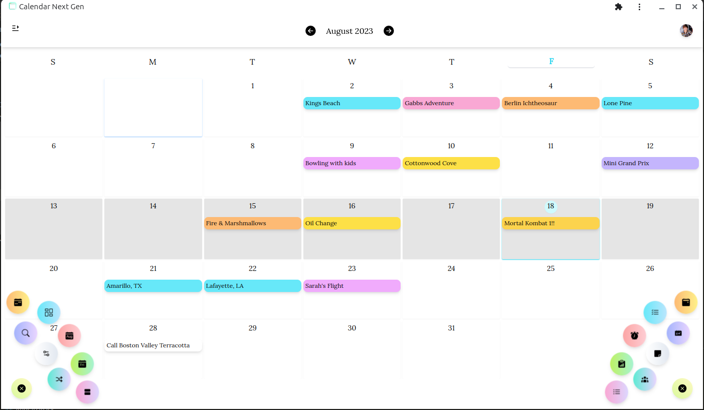
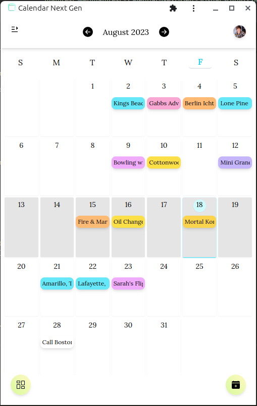

# Calendar Next Gen

## Version 1.0.0

 
 
 

<b>CNG is a PWA installable cross platform web application built for the orginized. There is a ton of functionality, integration & fun in this app. Some of the things that can be done with this app includes...</b>

<ul>
<li>Adding events, reminders, todo-lists, kanban boards, tasks & more</li>
<li>Sync with Google Calendar</li>
<li>Works online & offline!</li>
<li>Sign in with Google, Facebook, Github, Discord & more.</li>
</ul>

<b>Creating new Calendar content is meant to be as simple and as straightforward as possible. The UI/UX is build with the idea in mind that managing your day should be done with ease with as few clicks as possible & keep you organized.</b>

 
 

## Table Of Contents

- <a href="#design">Design</a>
  - <a href="#ui">UI</a>
  - <a href="#ux">UX</a>
- <a href="#functionality">Functionality</a>
  - <a href="#accounts">Accounts</a>
  - <a href="#delete-your-account">Deleting Your Account</a>
  - <a href="#adding-content">Adding Content</a>
  - <a href="#syncronizing">Synchronizing</a>
  - <a href="#installation">Installation</a>
- <a href="#security">Security</a>
  - <a href="#account-data">Account Data</a>
  - <a href="#user-agreement">User Agreement</a>
- <a href="#contributions">Contributions</a>
- <a href="#refrences">Refrences</a>

## Design

 
 
 

### UI

<b>CNG showcases an exceptional user experience and a thoughtfully designed user interface that effortlessly guides users through its features. It has a minimalist and intuitive layout which promotes clarity and ease of use, allowing users to accomplish tasks efficiently and effectively, such as managing a schedule, creating events, etc... The color scheme and typography enhance the overall aesthetic appeal, the default is a light and bright colors. This enhances the mood of the user and induces productivity and positivity.</b>

The app's responsive design seamlessly adapts to different devices, ensuring a consistent and enjoyable experience across screens. With its well-placed interactive elements and clear feedback, users can effortlessly navigate the app and complete tasks with confidence. The app's attention to detail, consistent branding, and helpful onboarding contribute to a delightful user experience that keeps users engaged and satisfied</b>

<ul>
<li>Supports Light & Dark themes. (light theme is default)</li>
<li>Light animations to keep a high performance profile & an unobtrusive experience, but still beautiful</li>
<li>Gestures supported on all major app elements</li>
<li>Completely cross browser compatable</li>
<li>Responsive layouts for ALL screen sizes</li>
</ul>

### UX

<b>CNG excels in functionality, providing users with a comprehensive set of features that cater to their scheduling needs. Its intuitive design ensures ease of use, allowing users to effortlessly create, manage, and organize their events and appointments. The app's seamless navigation enables users to swiftly switch between different calendar views, making it effortless to plan and track their schedules.</b>

Additionally, the app's helpful features such as reminders, notifications, and integration with other platforms enhance its utility, ensuring that users never miss important dates or deadlines. With its user-friendly interface and efficient functionality, the calendar app serves as an indispensable tool that simplifies scheduling and empowers users to stay organized and productive</b>

<ul>
<li>Supports adding events, reminders, kanban boards, task & todo Lists</li>
<li>Notifications are supported on desktop, mobile, web & in app</li>
<li>Full CRUD functionality. Create, Read, Update & Delete all data</li>
<li>Sync your Google Calendar data</li>
<li>Share events with friends or coworkers</li>
<li>Create multiple Calendars</li>
<li>Supports month view, day view, week view & schedule view</li>
<li>Create categories</li>
<li>Reorder times on events & reminders</li>
</ul>

## Functionality

 
 
 

### Accounts

<b>Creating an account & logging in has never been easier. With many options to choose from you can create a new account with 2 clicks of a button and zero configuration. Or you can fully customize your account as you desire. The data which is stored within the application for new users is minimal and secured. If ever your account is deleted all data will be wiped clean in relation of all datasets. No personal information other than a username, photo, email & password are stored.</b>

<ul>
<li>The website will not request again for your notification permissions if they are denied. You will need to manually turn notifications back on from the browser again if your mind changes.</li>
</ul>

### Login Options

<b>Your login options include a various set of simple methods to use including classical and social login methods. After an account is established two factor authentication or passkeys can be used for future authentication</b>

<b>Social Login Methods Available</b>

<ul>
<li>Google</li>
<li>Facebook</li>
<li>Discord</li>
<li>Apple</li>
</ul>

<i>Social sign in methods where the social platform has the same email as another will not create seperate accounts and instead only link two accounts together into one</i>

<b>Classic Login</b>

<ul>
<li>Username / Password / Email</li>
</ul>

<i>This is a classic way to login to an application. Clicking the sign in button will both create a new user with your credentials if one is not found in the database or log you in as your current self if you exsist. Do not fear, all of your data is changeable and editable</i>

<b>Furthur Auth</b>

<ul>
<li>Two factor authentication</li>
<li>Passkeys</li>
</ul>

<i>Both are viable safe methods for re-authenticating users who have been logged in for an extent period of time away from the application</i>

### Deleting Your Account

<b>Deleting your account after creation is easy and straight forward. Under settings within the application while you are logged in at the very bottom there is an option to delete your account with 2 clicks of a button.</b>

<i>Deleting your account will destroy all of your account data and all data related to your account. No information will be saved. Note: If you have imported Google calendar information all events will still be preserved in your Google calendar, but all information will be destroyed for Calendar Next Gen.</i>

### Adding Data

<b>Adding data to your account is secure and easy! No information is shared with other account holders. Unless you share your email to another by choice or allow another user to scan your friend request QRcode no user will ever have access to your information. Only emails are shared between connected users and friendships</b>

## Contributions

## Refrences
