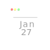

# Calendar Next Gen

## Version 1.0.0

 
 
 

<b>CNG is a PWA installable cross platform web application built for the orginized. There is a ton of functionality, integration & fun in this app. Some of the things that can be done with this app includes...</b>

<ul>
<li>Adding events, reminders, todo-lists, kanban boards, tasks & more</li>
<li>Sync with Google Calendar</li>
<li>Works online & offline!</li>
<li>Sign in with Google, Facebook, Github, Discord & more.</li>
</ul>

<b>Creating new Calendar content is meant to be as simple and as straightforward as possible. The UI/UX is build with the idea in mind that managing your day should be done with ease with as few clicks as possible & keep you organized.</b>

## Table Of Contents

- <a href="#design">Design</a>
  - <a href="#ui">UI</a>
  - <a href="#ux">UX</a>
- <a href="#functionality">Functionality</a>
  - <a href="#accounts">Accounts</a>
  - <a href="#adding-content">Adding Content</a>
  - <a href="#syncronizing">Synchronizing</a>
  - <a href="#installation">Installation</a>
- <a href="#security">Security</a>
  - <a href="#account-data">Account Data</a>
  - <a href="#user-agreement">User Agreement</a>
- <a href="#contributions">Contributions</a>
- <a href="#refrences">Refrences</a>

## Design

 
 
 

### UI

<b>CNG showcases an exceptional user experience and a thoughtfully designed user interface that effortlessly guides users through its features. It has a minimalist and intuitive layout which promotes clarity and ease of use, allowing users to accomplish tasks efficiently and effectively, such as managing a schedule, creating events, etc... The color scheme and typography enhance the overall aesthetic appeal, the default is a light and bright colors. This enhances the mood of the user and induces productivity and positivity.</b>

The app's responsive design seamlessly adapts to different devices, ensuring a consistent and enjoyable experience across screens. With its well-placed interactive elements and clear feedback, users can effortlessly navigate the app and complete tasks with confidence. The app's attention to detail, consistent branding, and helpful onboarding contribute to a delightful user experience that keeps users engaged and satisfied</b>

<ul>
<li>Supports Light & Dark themes. (light theme is default)</li>
<li>Light animations to keep a high performance profile & an unobtrusive experience, but still beautiful</li>
<li>Gestures supported on all major app elements</li>
<li>Completely cross browser compatable</li>
<li>Responsive layouts for ALL screen sizes</li>
</ul>

### UX

<b>CNG excels in functionality, providing users with a comprehensive set of features that cater to their scheduling needs. Its intuitive design ensures ease of use, allowing users to effortlessly create, manage, and organize their events and appointments. The app's seamless navigation enables users to swiftly switch between different calendar views, making it effortless to plan and track their schedules.</b>

Additionally, the app's helpful features such as reminders, notifications, and integration with other platforms enhance its utility, ensuring that users never miss important dates or deadlines. With its user-friendly interface and efficient functionality, the calendar app serves as an indispensable tool that simplifies scheduling and empowers users to stay organized and productive</b>

<ul>
<li>Supports adding events, reminders, kanban boards, task & todo Lists</li>
<li>Notifications are supported on desktop, mobile, web & in app</li>
<li>Full CRUD functionality. Create, Read, Update & Delete all data</li>
<li>Sync your Google Calendar data</li>
<li>Share events with friends or coworkers</li>
<li>Create multiple Calendars</li>
<li>Supports month view, day view, week view & schedule view</li>
<li>Create categories</li>
<li>Reorder times on events & reminders</li>
</ul>

## Functionality 

 
 
 

### Accounts

<b>Creating an account & logging in has never been easier. With many options to choose from you can create a new account with 2 clicks of a button and zero configuration. Or you can fully customize your account as you desire. The data which is stored within the application for new users is minimal and secured. If ever your account is deleted all data will be wiped clean in relation of all datasets. No personal information other than a username, photo, email & password are stored.</b>

<ul>
<li>The website will not request again for your notification permissions if they are denied. You will need to manually turn notifications back on from the browser agian if your mind changes.</li>
</ul>

### Adding Data

<b>Your locaton is shown in the notification from the data recieved by reverse geoloation provided by Open Weather Map's API... <a href="#location">See Location Info</a></b>

### Weather Data

<b>The weather data shown in the notification each hour is the current hours current temperature provided to you by Open Meteo's API... <a href="#weather-data">See Weather Data</a></b>

<i>THINGS TO CONSIDER</i>

<ul>
<li>No icon is shown in the notification as of Version 1.</li>
<li>Top 3 US News Articles</li>
</ul>

<b>Hourly notifications will persist when the tab on your browser is still open for the website. <i>No notification support for mobile devices.</i> You will be promted to accept notifications first. If accepted, it will display the current temperature of the hour in your area.</b>

<b>For an added touch to the website as any good weather site would include are three top news articles in the US that will redirect you to the article.</b>

## Data Reliability

 
 

### Accuracy And Features

- Data
  - Open Meteo & Open Weather Map provide you with extremely accurate information.
  - Open Meteo gathers weather information from all around the world and multiple data providers based on your country for the most up to data information in your area.
    - Todays Forcast
      - Weather Icon
      - weather Name
      - High Low
      - Precipitation % (avarage for the 24 period)
      - windspeed
      - UV Index
      - Sunrise/Sunset
      - Current date
    - Hourly Forcast
      - Weather Icon
      - High Temp
      - Humidity
      - Windspeed
      - Apparent Temp
      - Time (hour)
    - Daily Forcast
      - Weather icon
      - Week Day
      - High/Low temp
      - Sunrise/Sunset
      - Precipitation Percentage
      - UV Index
  - Open Weather Maps large store of cities, towns, countries, states & counties garuntees you will be provided with percice location information based on your longitude and latitude.
    - If no state is present it will show your city/town and country
- UI
  - SVG Icons for 7 different weather states are provided.
    - Rain
    - Snow
    - Sun
    - Clouds
    - Storm
    - Drizzle
    - Fog
  - The application will automatically dedect wether or not it is day time or night time by cross refrencing the current hour and the hourly sunset/sunrise data given from Open Meteo API
  - Today's Forcast, Hourly Forcast & Weekly Forcast are split between three sections for ease of access and orginization

## Contributions

## Refrences
